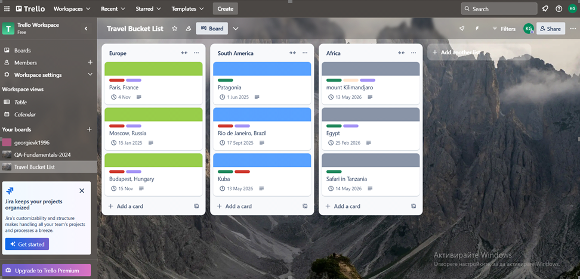
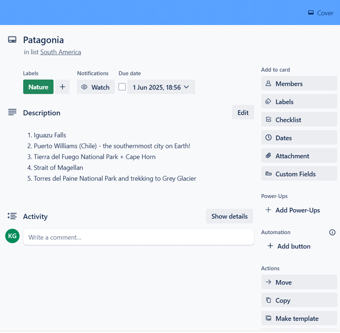
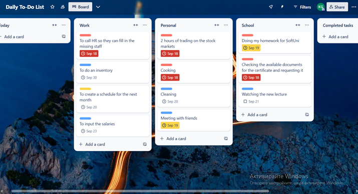
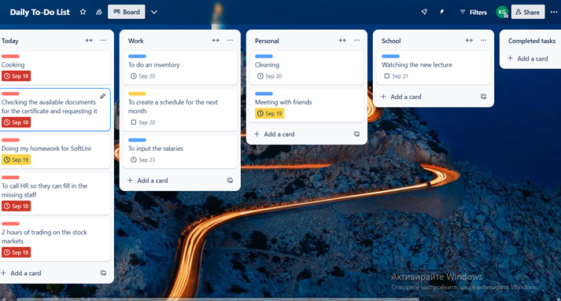
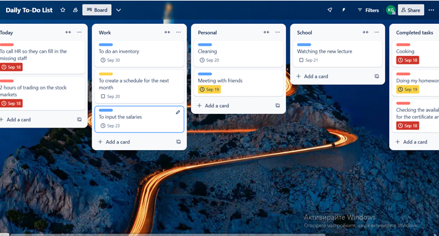
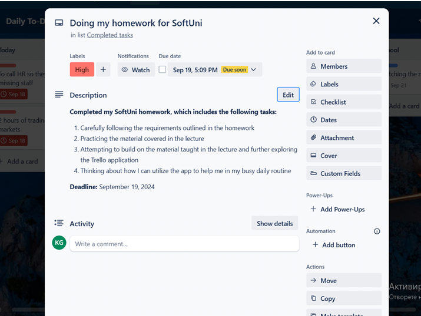

# 🧩 Homework: Computer Systems and Software – Trello

### Course: Software Technologies @ Software University  
**Assignment Type:** Practical Trello Project  

---

## 🌍 Part 1: Travel Bucket List

### Task Description
You will create a personal Trello board that visualizes the destinations you’d like to visit around the world.  
This project helps you practice organizing ideas using Trello boards, lists, and cards.

### Steps
1. Create a **new Trello board** titled **“Travel Bucket List”** (do not use any templates).  
2. Add a **separate list** for each continent or region you’d like to visit.  
   - Example: *Europe*, *Australia*, *Asia*, etc.  
3. Under each list, create **three cards**, each representing a country, city, or location you’d love to explore.  
   - Example: Under “Europe” → *Paris*, *Italy*, *Fishing Village in Portugal*.  
4. Use the **label feature** to categorize your destinations by type — *Beach*, *Adventure*, *Culture*, *Nature*, *Hobby*, etc.  
5. In each card’s **description**, include must-see attractions or experiences you’d like to do there.  
6. Add **due dates** for the destinations you plan to visit within the next 5 years.  
7. Take a **screenshot of your full board** and replace the example photo with it.  
8. Take another **screenshot of one card** (showing its labels, description, and due date) and add it below.  

---

### 🖼️ Screenshots – Travel Bucket List

**Full Board View:**  
*(Insert your first screenshot below)*  

**Example Destination Card:**  
*(Insert your second screenshot below)*  

---

## ✅ Part 2: Manage Your Daily Tasks

### Task Description
This part focuses on managing your everyday responsibilities through Trello.  
You’ll create a personal productivity board that helps you track and organize daily priorities.

### Steps
1. Create a **new board** called **“Daily To-Do List”**.  
2. Add **lists** representing different task categories — *Work*, *Personal*, *School*, etc.  
3. Include an additional list called **“Today”** for your daily priorities.  
4. Create **cards** for each specific task you need to complete.  
5. Use **labels** to mark task priority — *High*, *Medium*, *Low*.  
6. Set **due dates** for time-sensitive tasks.  
7. Move tasks from their category lists into the “Today” list to stay focused.  
8. Use **Trello’s mobile app** to check and update tasks on the go.  
9. Take a **screenshot** of your board showing all lists and cards you’ve created.  
10. Take another **screenshot** of a **completed task card**, showing that it’s finished.  

---

### 🖼️ Screenshots – Daily Task Manager

**Full Board View (1/4):**  

**Full Board View (2/4):**  

**Completed Task (3/4):**  

**Completed Task (4/4):**  

---

