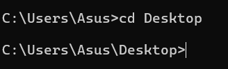
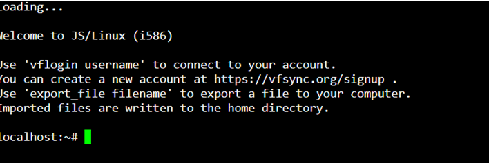

# 💻 Homework: Exploring Operating Systems and Command-Line Tools

### Course: Software Technologies @ Software University  
**Assignment Type:** Hands-on Practice  

---

## 🧠 Part 1: Task Manager Exploration (Windows)

### Objective
Analyze system performance and manage processes using Windows Task Manager.

### Steps
1. Open Task Manager and view the list of running processes.  
2. Identify which processes consume the most **CPU** or **RAM**.  
3. Select one process and end it using **End Task**.  
4. Go to the **Performance** tab to view **CPU** and **Memory** usage.  

### Screenshots – Task Manager
**Screenshot 1:** Running processes overview  


**Screenshot 2:** High CPU usage process  


**Screenshot 3:** High RAM usage process  


**Screenshot 4:** Ending a process  


**Screenshot 5:** Performance tab (CPU & Memory)  


---

## 🧩 Part 2: Navigating with Windows Terminal

### Objective
Practice directory navigation and folder management via Windows Terminal.

### Steps
1. Navigate to common directories using `cd`:  
   - `Desktop`  
   - `Documents`  
   - `Downloads`  
2. Create a folder on the Desktop named `My_SoftUni_Repo` using:
   ```
   mkdir My_SoftUni_Repo
   ```  
3. Enter the newly created folder using:
   ```
   cd My_SoftUni_Repo
   ```  
4. Experiment with additional commands and folder navigation as needed.

### Screenshots – Windows Terminal
**Screenshot 1:** Desktop directory  


**Screenshot 2:** Documents directory  


**Screenshot 3:** Downloads directory  


**Screenshot 4:** Folder creation  


**Screenshot 5:** Entering folder  


**Screenshot 6:** Extra navigation/command  


**Screenshot 7:** Folder contents view  


---

## 🐧 Part 3: Working with Docker Playground & Linux Shell

### Objective
Run a Linux container in Docker Playground and perform an HTTP request to an API.

### Steps
1. Start a new Linux container in Docker Playground.  
2. Use `curl` to make an HTTP request to the **Zippopotam.us API**:
   ```
   curl https://api.zippopotam.us/de/10115
   ```  
3. Observe the JSON response returned by the API.  

### Screenshots – Docker Playground
**Screenshot 1:** Running container  


**Screenshot 2:** HTTP request command  


**Screenshot 3:** API response in terminal  


**Screenshot 4:** Additional container view or terminal info  


---
