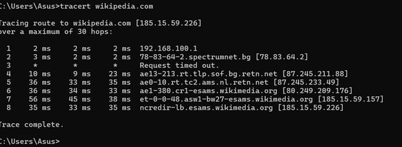

# 🌐 Exercise: Networks, Internet, and Protocols

### Course: Software Technologies @ Software University  
**Assignment Type:** Practical Networking Exercises  
**Submission:** Complete all tasks and include screenshots as evidence of your work.

---

## 🧭 Part 1: Trace Route and Connectivity

### Objective
Understand how data travels over the network and verify connectivity to external websites.

### Steps
1. **Trace the route**  
   - Use the `tracert` command to check the network path to a website of your choice.  
     - Example: `tracert wikipedia.com`  

2. **Test connectivity**  
   - Use the `ping` command to measure latency and packet loss to the same website.  
     - Example: `ping wikipedia.com`  

### Screenshots – Trace and Ping
**Screenshot 1:** Traceroute result  
*(Insert your first screenshot here)*  

**Screenshot 2:** Ping result  
*(Insert your second screenshot here)*  

---

## 🖥️ Part 2: Discovering IP Address of a Domain

### Objective
Learn to determine the IP address behind a domain name using online DNS tools.

### Steps
1. Go to a DNS lookup tool such as **DNS Checker** or **MX Toolbox**.  
2. Enter a domain name of your choice to find its IP address.  
   - Example: `medium.com`  

### Screenshots – DNS Lookup
**Screenshot 3:** IP address lookup result  
*(Insert your third screenshot here)*  

---

## 🌍 Part 3: Executing an HTTP GET Request

### Objective
Perform a GET request to retrieve data from a public API and inspect the response in your browser.

### Steps
1. Open your browser's **DevTools** (F12 or right-click → Inspect).  
2. Use the API endpoint `https://restcountries.com/v3.1/name/{country_name}` to request data for a country of your choice.  
   - Example: `https://restcountries.com/v3.1/name/deutschland`  

### Screenshots – HTTP GET Request
**Screenshot 4:** GET request result with DevTools open  
*(Insert your fourth screenshot here)*  

---
