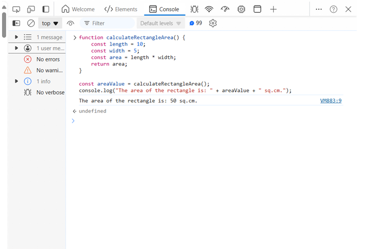
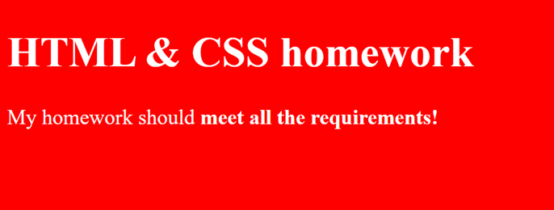
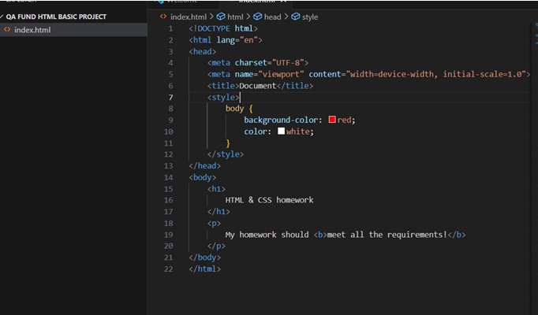

# 🖥️ Homework: Programming Languages

### Course: Software Technologies @ Software University  
**Assignment Type:** Practical Exercises  
**Submission:** Complete all tasks and include screenshots from your own computer.

---

## 💻 Part 1: JavaScript – Calculating Rectangle Area

### Objective
Practice creating and executing JavaScript functions in the browser console.

### Steps
1. Open your browser's **Developer Console** (F12 or right-click → Inspect → Console).  
2. Create a JavaScript function that calculates and returns the area of a rectangle:  
   ```javascript
   function calculateRectangleArea(length, width) {
       return length * width;
   }
   ```  
3. Define constants for the rectangle dimensions and assign some sample values:  
   ```javascript
   const length = 10;
   const width = 5;
   ```  
4. Execute the function in the console and print the result in the following format:  
   ```javascript
   console.log("The area of the rectangle is: " + calculateRectangleArea(length, width) + " sq.cm.");
   ```  

### Screenshots – JavaScript
**Screenshot 1:** JS function execution in the console  


---

## 🌐 Part 2: HTML & CSS – Simple Web Page

### Objective
Create a basic web page using HTML and CSS following the tutorial from the exercise document.

### Steps
1. Use the tutorial to design a simple web page.  
2. Make sure the web page includes:  
   - Headings  
   - Paragraphs  
   - Basic CSS styling (colors, fonts, layout)  
3. Test your page in the browser and ensure it visually matches the example structure.

### Screenshots – HTML & CSS
**Screenshot 2:** Web page layout view  


**Screenshot 3:** Web page with applied CSS styling  



---

