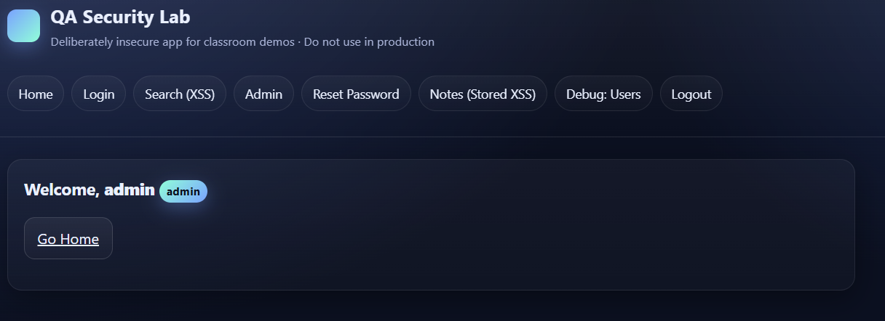
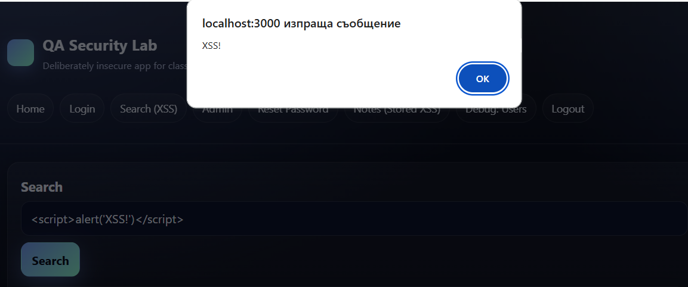
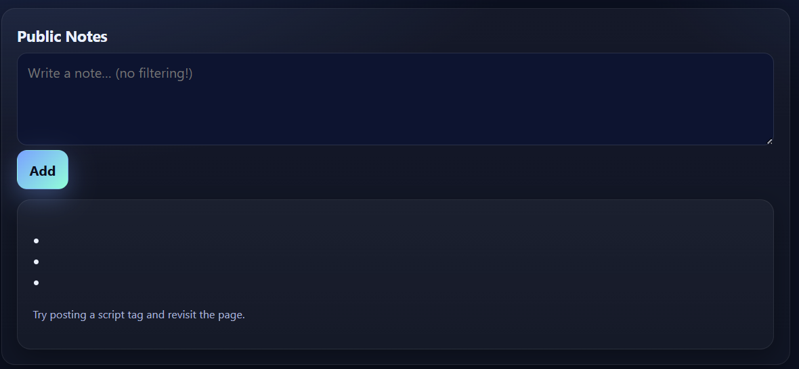
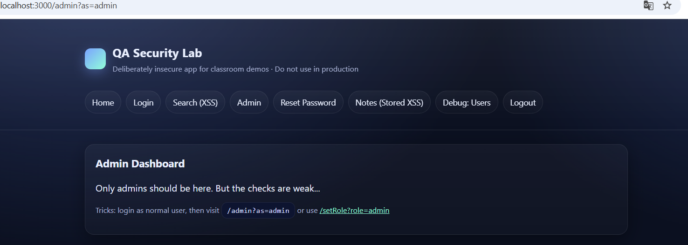
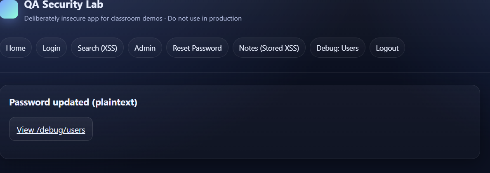

# 🛡️ Security Testing Exercise — SoftUni Demo Site (Neutral Report)

> **Note:** This exercise is intended for educational purposes only and should be performed only in a local or explicitly authorized test environment. Do not use these techniques against systems you are not authorized to test.

## Description
This exercise analyzes common web application vulnerabilities, illustrated through a demo application (SoftUni demo). The objective is to reproduce vulnerabilities, document observations, analyze causes, and propose practical prevention measures.

---

## General Requirements
- Local installation of the demo Node/Express application.  
- Browser with DevTools (e.g., Chrome/Firefox).  
- Optional tools for decoding/formatting data.  
- Prohibition on testing against unauthorized systems.

---

## 1) SQL Injection — Login Bypass 💉

**Requirement:** Test for vulnerability in the login form by injecting SQL syntax in the input fields.

**Steps**
1. Open `/login`.  
2. Enter:
   - username: `admin`  
   - password: `' OR '1'='1`  
3. Click **Login**.

**Observation**  
- Access is granted to the administrator account without entering the correct password.


**Analysis**  
- Input values were concatenated directly into an SQL query, allowing manipulation of the WHERE clause logic. The injected fragment `OR '1'='1'` makes the condition always true and grants access.

**Prevention**  
- Use parameterized queries (prepared statements).  
- Validate and sanitize all input data.  
- Minimize database user privileges and monitor unusual queries.

---

## 2) Reflected XSS ✨

**Requirement:** Test if input fields are reflected in the HTML response without proper escaping (reflected XSS).

**Steps**
1. Open `/search`.  
2. Enter in the search field:
```
<script>alert('XSS!')</script>
```

3. Submit the form.

**Observation**  
- Browser executes the script (alert dialog appears).


**Analysis**  
- User input is reflected in the HTML response without proper escaping, allowing execution in the page context.

**Prevention**  
- Contextually escape all data before inserting into HTML.  
- Apply Content Security Policy (CSP).  
- Limit allowed characters/formats for specific fields where possible.

---

## 3) Stored (Persistent) XSS — Public Notes 📝

**Requirement:** Test if stored user input is rendered without sanitization and executes when the page loads.

**Steps**
1. Navigate to `/notes`.  
2. Add a new note with content:
```
<script>alert('stored XSS')</script>
```

3. Reload the page and/or view the notes.

**Observation**  
- The script executes every time the notes are viewed.


**Analysis**  
- Input is stored in the database and rendered in HTML without filtering, making the vulnerability persistent and potentially more dangerous.

**Prevention**  
- Sanitize input on save (e.g., using DOMPurify).  
- Escape all dynamic values when rendering.  
- Use template engines that escape content by default.

---

## 4) Broken Access Control — Role Escalation 🔐

**Requirement:** Check whether access rights are validated server-side and whether client-side parameters can manipulate roles.

**Steps**
1. Log in as a regular user (e.g., `/login` with `user` / `test`).  
2. Navigate to `/admin`.  
3. Try modifying the URL with parameters, e.g., `/admin?as=admin` or `/setRole?role=admin` (if present).

**Observation**  
- Access to administrative functionality is granted when modifying client-side parameters/cookies.


**Analysis**  
- Authorization checks rely on client-controlled data (query params, cookies) instead of validating the role against the server-side session/database.

**Prevention**  
- Perform authorization only server-side based on authentication and server records.  
- Store only session identifiers client-side; roles are retrieved server-side.  
- Protect against session tampering using signed/encrypted sessions with limited privileges.

---

## 5) Password Mismanagement — Weak Policy & Plaintext 🔓

**Requirement:** Validate password policies and check whether passwords are stored securely.

**Steps**
1. Use `/reset-password` to set a new password (e.g., `1234`).  
2. Check for debug routes (e.g., `/debug/users`) to see if passwords are exposed.

**Observation**  
- Weak passwords are accepted; passwords may be exposed in plain text via debug routes (if present).


**Analysis**  
- Lack of complexity requirements and/or absence of hashing/salting makes credentials easily compromised if breached.

**Prevention**  
- Enforce strong password policies (minimum length, character requirements, block common passwords).  
- Hash passwords using algorithms like bcrypt or Argon2 with salts.  
- Remove debug/admin endpoints in production.

---

## 6) Unencrypted Communication (HTTP vs HTTPS) 🔒

**Requirement:** Verify if the application uses TLS/HTTPS and whether sensitive data is transmitted securely.

**Steps**
1. Check the URL scheme (e.g., `http://localhost:3000`).

**Observation**  
- Traffic over HTTP is unencrypted; data and cookies are sent in plaintext.

**Analysis**  
- Lack of TLS allows eavesdropping and manipulation of network traffic.

**Prevention**  
- Configure HTTPS (TLS), redirect HTTP → HTTPS.  
- Use `Secure`, `HttpOnly`, `SameSite` flags for cookies.  
- Enable HSTS.

---

## 7) Insecure Cookies / Session Manipulation 🍪

**Requirement:** Check if session data is stored in cookies in a way that allows client-side modification.

**Steps**
1. Log in as a user.  
2. Open DevTools → Application → Cookies and locate the `session` or similar cookie.  
3. Decode and modify the content (e.g., `role: user` → `role: admin`) and reload.

**Observation**  
- Modified cookie grants elevated access if server-side validation is missing.

**Analysis**  
- Storing user data directly in unencrypted/unsigned cookies allows tampering.

**Prevention**  
- Store only session ID in cookies; manage session server-side.  
- Mark cookies as `HttpOnly`, `Secure`, `SameSite`.  
- Sign/encrypt tokens (JWT with signature verification).

---

## 8) Security Misconfiguration / Verbose Errors ⚙️

**Requirement:** Evaluate error messages for technical detail exposure.

**Steps**
1. Attempt login with a non-existent user and with an invalid password.  
2. Compare error messages.

**Observation**  
- Different messages reveal account existence information.

**Analysis**  
- Detailed messages enable user enumeration and system fingerprinting.

**Prevention**  
- Return generic messages (`Invalid username or password`).  
- Log details only server-side.  
- Hide stack traces and internal errors from users.

---

## 9) No Rate Limiting (Brute Force) ⏱️

**Requirement:** Verify the presence of mechanisms that limit login attempts.

**Steps**
1. Perform repeated failed login attempts at `/login`.

**Observation**  
- No delay, lockout, or CAPTCHA; unlimited attempts possible.

**Analysis**  
- Lack of rate limiting allows brute-force and credential stuffing attacks.

**Prevention**  
- Implement rate limiting (per IP/user), account lockout, exponential backoff.  
- Add CAPTCHA/recaptcha and multi-factor authentication (MFA).

---

## 10) Logout / Caching Quirk 🔁

**Requirement:** Check behavior after logout and page caching.

**Steps**
1. Log in and open a protected page.  
2. Perform logout.  
3. Press Back in the browser.

**Observation**  
- Some protected pages may still be accessible from the browser cache after logout.

**Analysis**  
- Lack of proper cache-control headers and/or server-side session invalidation allows content visibility after logout.

**Prevention**  
- Invalidate sessions server-side on logout.  
- Add `Cache-Control: no-store, no-cache, must-revalidate`, `Pragma: no-cache`, `Expires: 0`.  
- Regenerate session ID upon authentication/role change.

---

## Executive Checklist
- [ ] Use parameterized queries instead of concatenation in SQL  
- [ ] Escape and/or sanitize output when rendering (XSS)  
- [ ] Server-side authorization validation (roles/permissions)  
- [ ] Enforce strong password policies + hashing (bcrypt/Argon2)  
- [ ] TLS/HTTPS in all environments (redirect HTTP → HTTPS)  
- [ ] HttpOnly/Secure/SameSite flags for session cookies  
- [ ] Generic login errors (no user enumeration)  
- [ ] Rate limiting / account lockout mechanisms  
- [ ] Server-side session invalidation and cache-control headers
